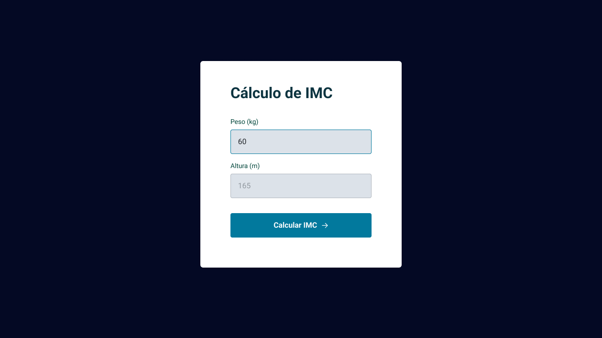

<h1 align="center"> stage 05 Desafio 03   Calculadora de IMC </h1>

  <a href="#-tecnologias">Tecnologias</a>&nbsp;&nbsp;&nbsp;|&nbsp;&nbsp;&nbsp;
  <a href="#-projeto">Projeto</a>&nbsp;&nbsp;&nbsp;|&nbsp;&nbsp;&nbsp;
  <a href="#-layout">Layout</a>&nbsp;&nbsp;&nbsp;|&nbsp;&nbsp;&nbsp;
  <a href="#memo-licença">Licença</a>

  

 
  

   

## 🚀 Tecnologias

Esse projeto foi desenvolvido com as seguintes tecnologias:

- HTML 
- CSS
- Github
- Figma
- JavaScript

## 💻 Projeto

  Esse projeto foi desenvolvido utilizando HTML, CSS e JavaScript, e consiste em um programa interativo em que os usuários escrevem seu peso e sua altura e clicam no botão "calcular imc" para descobrirem seu Índice de Massa Corporal.

<h2> Conceitos usados na aplicação</h2>

<ul>
  <li>Estilização do Cartão</li>
  <li>Configuração de Fontes e Cores</li>
  <li>Criação de Modal</li>
  <li>Construção de Caixa de Alerta de Erro</li>
  <li>Apresentação do Resultado do IMC no Popup</li>
  <li>ES6 Modules</li>
  <li>Validação de Dados</li>
  <li>Modularização das Funções Utilitárias</li>
  <li>Refatoração da Função de Submit</li>
  <li>Aplicação das Regras Clean Code</li>
</ul>
      
 

- [Visite o projeto online](https://iaraMarques.github.io/IMC-Calculator)

 

## 🔖 Layout

Você pode visualizar o layout do projeto através [DESSE LINK](https://www.figma.com/file/g6ev53rTGYkohM5rIfSqm4/IMC-Copy?fuid=1197013043550409364). É necessário ter conta no [Figma](https://figma.com) para acessá-lo. 

  

## :memo: Licença

Esse projeto está sob a licença MIT.

---

Feito com ♥ by Iara Marques :wave: [Participe da comunidade da RocketSeat!](https://discord.gg/rocketseat)
